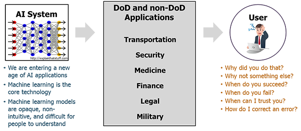

# Explainable AI
“Explainable AI is a set of tools and frameworks to help you understand and interpret predictions made by your machine learning models. With it, you can debug and improve model performance, and help others understand your models' behaviour”

<a href="Ai.png">How Explainable AI makes things easier</a>

[Documentation](https://linktodocumentation)

What is causing the transition?
This transition is coming for various reasons:
Understanding what happens when Machine Learning models make predictions could help speed up the widespread adoption of these systems. New technologies always take time to become mature, but it definitely helps if they are understood.
It makes users become increasingly comfortable with the technology, and removes the magical veil which seems to surround AI. Having users that trust the systems that they are using is of utmost importance.
For some sectors like insurance or banking, there are sometimes company level or even legislative restrictions that make it a must for the models that these companies use to be explainable.
In some other critical areas, like for example medicine, where AI can have such a great impact and amazingly improve our quality of life, it is fundamental that the used models can be trusted without a hint of a doubt. Having a Netflix recommendation system that sometimes outputs strange predictions might not have a very big impact, but in the case of medical diagnosis, uncommon predictions could be fatal. Providing more information that just the prediction itself allows the users to decide whether they trust the prediction or not.
Explainable models can help their users make better use of the outputs such models give, making them have even more impact in the business/research or decision making. We should always have in mind that like any other technology, the goal of AI is to improve our quality of life, so the more benefit we can extract from it, the better.## Color Reference

| Reference             | Name of courses                                                                |
| ----------------- | ------------------------------------------------------------------ |
|Python Basic for data scence|  |
|Pandas Overview |   |
|Numpy Overview |   |
|Data visualzation|   |

