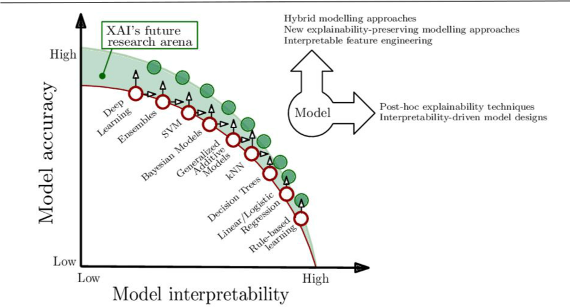
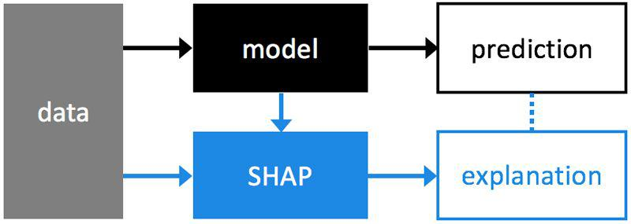
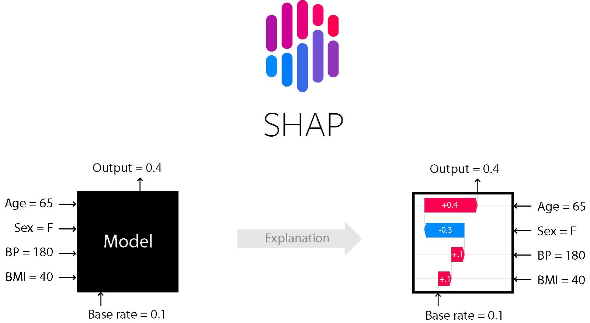

# Explainable AI
“Explainable AI is a set of tools and frameworks to help you understand and interpret predictions made by your machine learning models. With it, you can debug and improve model performance, and help others understand your models' behaviour”

<a href="Ai.png">How Explainable AI makes things easier</a>

[Documentation](https://linktodocumentation)

What is causing the transition?
This transition is coming for various reasons:
Understanding what happens when Machine Learning models make predictions could help speed up the widespread adoption of these systems. New technologies always take time to become mature, but it definitely helps if they are understood.
It makes users become increasingly comfortable with the technology, and removes the magical veil which seems to surround AI. Having users that trust the systems that they are using is of utmost importance.
For some sectors like insurance or banking, there are sometimes company level or even legislative restrictions that make it a must for the models that these companies use to be explainable.
In some other critical areas, like for example medicine, where AI can have such a great impact and amazingly improve our quality of life, it is fundamental that the used models can be trusted without a hint of a doubt. Having a Netflix recommendation system that sometimes outputs strange predictions might not have a very big impact, but in the case of medical diagnosis, uncommon predictions could be fatal. Providing more information that just the prediction itself allows the users to decide whether they trust the prediction or not.
Explainable models can help their users make better use of the outputs such models give, making them have even more impact in the business/research or decision making. We should always have in mind that like any other technology, the goal of AI is to improve our quality of life, so the more benefit we can extract from it, the better.## Color Reference

Accuracy vs Interpretability Trade-off
There exists a typical Trade-off between Model Performance and Interpretability just like we have our standard Bias vs. Variance Trade-off in machine learning.
In the industry, you will often hear that business stakeholders tend to prefer models which are more interpretable like linear models (linear\logistic regression) and trees which are intuitive, easy to validate and explain to a non-expert in data science.
This increases the trust of people in these models since its decision policies are easier to understand.
However, if you talk to data scientists solving real-world problems in the industry, they will tell you that due to the inherent high-dimensional and complex nature of real-world datasets, they often have to leverage machine learning models which might be non-linear and more complex in nature which are often impossible to explain using traditional methods (ensembles, neural networks).
Thus, data scientists spend a lot of their time trying to improve model performance but in the process trying to strike a balance between model performance and interpretability.

<a href="AI2.png">
Accuracy vs Interpretability Trade-off</a>

Existing techniques to evaluate models
If you’ve been building some Machine Learning models, you might’ve used the model performance evaluation metrics like precision, recall, accuracy, ROC curve and the AUC (for classification models) and the coefficient of determination (R-square), root mean-square error, mean absolute error (for regression models) as the ultimate truth for how good your model is, right?
But that score doesn’t really take into account how interpretable or easy to understand the model is.
Talking about Exploratory Data Analysis and visualization techniques. Some of these techniques can help us in identifying key features and meaningful representations from our data which can give an indication of what might be influential for a model to take decisions in a human-interpretable form. But that still isn’t enough since in the real-world, a model’s performance often decreases and plateaus over time after deployment due to variability in data features, added constraints and noise.
Thus, we need to constantly check for how important features are in deciding model predictions and how well they might be working on new data points.

SHAP (SHapley Additive exPlanations) is a unified approach to explain the output of any machine learning model.
It combines game theory with machine learning models.
It has optimized functions for interpreting tree-based models and a model agnostic explainer function for interpreting any black-box model for which the predictions are known.
In summary, Shapley’s values calculate the importance of a feature by comparing what a model predicts with and without this feature. However, since the order in which a model sees the features can affect its predictions, this is done in all possible ways, so that the features are compared fairly. This approach is inspired by game theory.
SHAP is used to explain an existing model. Taking a binary classification case built with a sklearn model. We train, tune and test our model. Then we can use our data and the model to create an additional SHAP model that explains our classification model.

Why is SHAP a more popular and reliable technique?
Missingness: If the simplified inputs represent feature presence, then missingness requires features missing in the original input to have no impact
Consistency: Consistency states that if a model changes so that some simplified input’s contribution increases or stays the same regardless of the other inputs, that input’s attribution should not decrease
Efficiency: As the foundation of SHAP values is based on computational game theory, this is the only method that can fairly distribute the gain of the feature.
Global comparison: SHAP values provide a way to compare the feature importance at a global level. You can also change the dataset from global to a subset dataset of interest.

Drawbacks
1.Computation time: Number of possible combinations of the features exponentially increases as more number of features are added. This in turn increases the turn around time of calculating SHAP values, and approximation is the only solution.
2.Order of feature selection in all possible combinations: Typically while solving real world problems, the target is non-linearly related with the independent features, and there is some correlation amongst the independent features too. In such cases the order in which the features are selected in the combination matters and can impact the SHAP values.
3.Simulation of scenarios: SHAP doesn’t return a model, like LIME. So if you want to simulate scenarios of increase in a particular feature will impact the output by how much, then it’s not possible with SHAP.
4.Correlation amongst independent features: Again in most real world problems the independent features will be correlated. In such situations, when we sample from feature’s marginal distribution there can be instances generated which might not be possible in real world.

SHAP Visualizations
-The SHAP library offers different visualizations.
-To date, force plots have been the default method for visualizing individual model predictions.
-SHAP decision plots show how complex models arrive at their predictions (i.e., how models make decisions).
-The summary plot shows the most important features and the magnitude of their impact on the model. It can take several graphical forms and for the models explained by TreeExplainer we can also observe the interaction values using the “compact dot” with shap_interaction_values in input.
-The dependency plot allows to analyze two features at a time by suggesting a possibility to observe the interactions. The scatter plot represents a dependency between a feature(x) and the shapley values (y) colored by a second feature(hue).

Learning Objectives
ELI5 
Skater
What-If Tool 
Azure ML
Till now, we’ve learned about 2 Explainable AI Frameworks - LIME and SHAP.
There are more such tools/ frameworks that can be utilized for model interpretation. Let’s have a look at those briefly. If you find any of them interesting, you can explore them in detail.
ELI5
ELI5 is a Python package which helps to debug machine learning classifiers and explain their predictions in an easy to understand an intuitive way.
It is perhaps the easiest of the three machine learning frameworks to get started with since it involves minimal reading of documentation!
However it doesn’t support true model-agnostic interpretations and support for models are mostly limited to tree-based and other parametric\linear models.
You can install it using pip install eli5
<h>Skater<\h>
Skater is a unified framework to enable Model Interpretation for all forms of models to help one build an Interpretable machine learning system often needed for real world use-cases using a model-agnostic approach.
It is an open source python library designed to demystify the learned structures of a black box model both globally(inference on the basis of a complete data set) and locally(inference about an individual prediction).
You can typically install Skater using a simple pip install skater
What-If Tool
The What-If Tool (WIT) provides an easy-to-use interface for expanding understanding of a black-box classification or regression ML model.
With the plugin, you can perform inference on a large set of examples and immediately visualize the results in a variety of ways.
The purpose of the tool is that give people a simple, intuitive, and powerful way to play with a trained ML model on a set of data through a visual interface with absolutely no code required.
The tool can be accessed through TensorBoard or as an extension in a Jupyter or Colab notebook.
A custom prediction function can be used to load any model, and provide additional customizations to the What-If Tool, including feature attribution methods like SHAP, Integrated Gradients, or SmoothGrad.
Here’s the What-if Tool demo for the same dataset we used for SHAP implementation(UCI Dataset).
Look at the beautiful interactive visualisations it creates: https://pair-code.github.io/what-if-tool/demos/uci.html

| Reference             | Name of courses                                                                |
| ----------------- | ------------------------------------------------------------------ |
|Python Basic for data scence|  |
|Pandas Overview |   |
|Numpy Overview |   |
|Data visualization|   |

